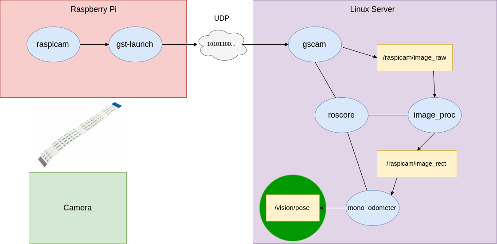
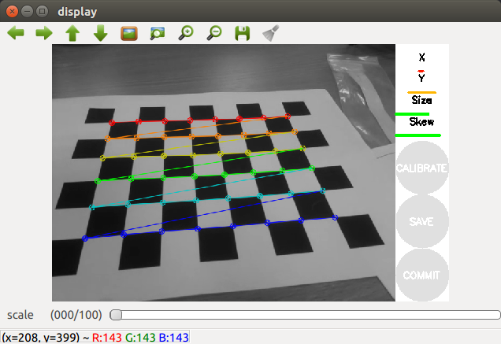
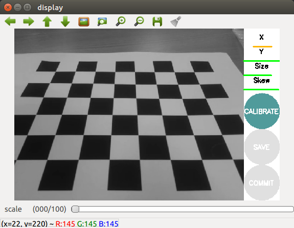

# Visual Odometry

[Reference link @ ROS Discourse](https://discourse.ros.org/t/ros-visual-odometry/2465)

----

## System architecture

So, the graph of our system looks like this:



As you can see in this picture, we have Raspberry Camera connected and raspicam creating multimedia pipeline and sending video from camera to `gst-launch`. The latter then transmit the image to our server over UDP. [gscam](https://github.com/RoboticaUtnFrba/gscam) will broadcast the video to `/raspicam/image_raw` topic. This image should be rectified with `image_proc` node. And finally, rectified image is taken by `mono_odometer`, which handles it and computes position and orientation of the robot publishing this data straight to the `/vision/pose` topic.

## Preparing the environment

This tutorial will consider that you already have the hardware conected. For full information, see the reference link.

### Getting started

Firstly, ssh **into Raspberry** and start broadcasting video **to our server**:

```sh
$ roscd ca_visual_odometry/scripts
$ ./stream_raspicam <HOST_IP>
```

Find the IP of the server using `ifconfig`.

Then launch the ROS nodes in the server:

```
$ roslaunch ca_visual_odometry stream_test.launch
```

## Calibrating the camera

You will need to have printed [this checkerboard](media/check-108.pdf).

Run the calibration node with this command:

```
$ roslaunch ca_visual_odometry calibrate.launch
```



In order to get a good calibration you will need to move the checkerboard around in the camera frame such that:

* checkerboard on the camera’s left, right, top and bottom of field of view
    * X bar - left/right in field of view
    * Y bar - top/bottom in field of view
    * Size bar - toward/away and tilt from the camera
* checkerboard filling the whole field of view
* checkerboard tilted to the left, right, top and bottom

As you move the checkerboard around you will see three bars on the calibration sidebar increase in length. When the **CALIBRATE** button lights, you have enough data for calibration and can click **CALIBRATE** to see the results.



Calibration can take about a minute. The windows might be greyed out but just wait, it is working.

 You will need to move the generated .yaml file that's in `/tmp/calibrationdata.tar.gz`. Extract and rename it to `ost.yaml` and move it to the `ca_visual_odometry/config` directory.

 Then you can execute the visual odometry doing this:

 ```
 $ roslaunch ca_visual_odometry vo_raspicam.launch rviz:=true
 ```

 This will rectify the image and will use [viso2](https://github.com/RoboticaUtnFrba/viso2).
